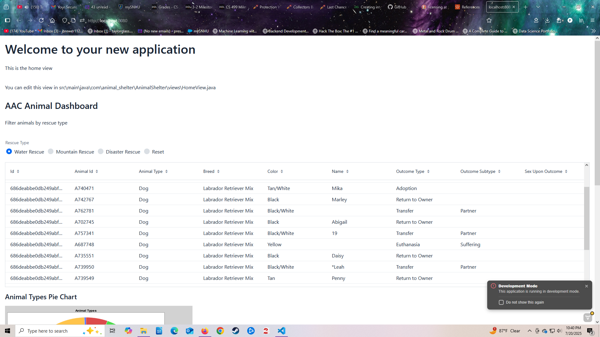
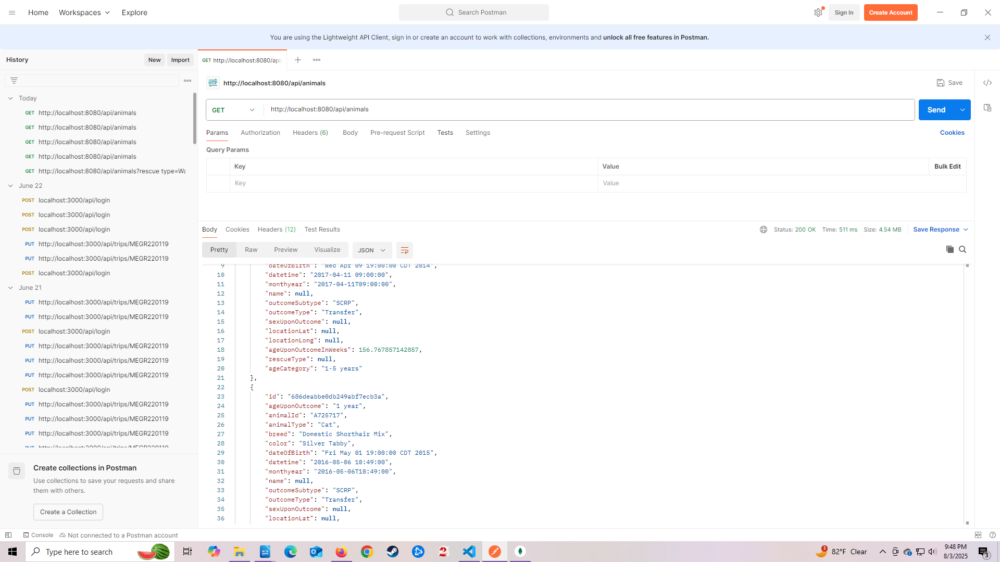
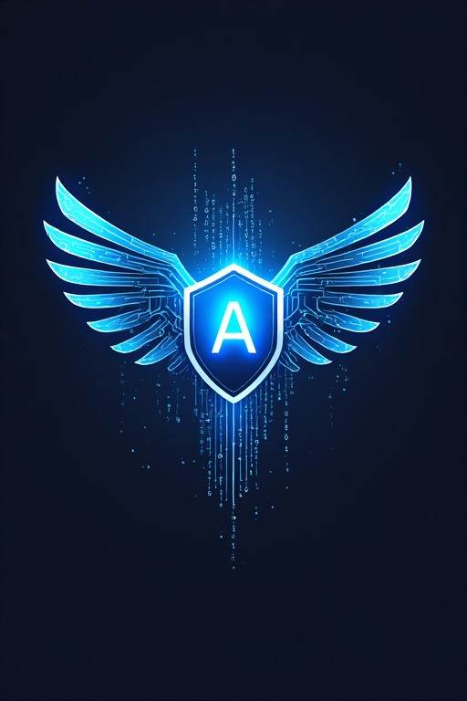

# 
Jake Brewer
  
### 
Computer Science Graduate | Full-Stack Developer | Security-Focused Engineer

### Professinal Portfolio 
 
---
#### My passion is to build secure, accessible and scalable applications with a focus on AI architecture, full-stack development, system security, and real-world scenarios.  
#### My experience includes:
    • Java, Python, JavaScript and C# 
    • Full-stack web development (Spring Boot, Vaadin, MongoDB) 
    • Mobile development (Kotlin)
    • Security practices (authentication, input validation, vulnerability analysis, secure coding, OWASP) 
    • Data structures, algorithms, and performance optimization 
#### I aim to specialize in transforming simple visions such as AVA (blue team AI defender), into production-ready applications with clean architecture and practical security. 

---
### Ava – AI Security Assistant (Featured Project)
#### Explore Ava's Development (Alpha v0.1 → Alpha v1.0) 
    • AI-powered defensive security tool (blue team)
    • Detects vulnerabilities, open ports, log analysis and reports
    • Fast API integration
    • Built with modular architecture 
    • Future: SIEM + automation + AI modules
#### [Main Repository] https://github.com/prestige1124/Ava-Core.git
#### [View All Versions] https://github.com/prestige1124/Ava-Core/releases

---
### Animal Shelter Full-Stack Application (SNHU Capstone)
#### Before planned enhancements:
    • Simple Python Dash SPA 
    • Basic filtering + charts 
    • Built in VM with stored data
#### [Main Repository] https://github.com/prestige1124/CS-340-Client-Server-Development/blob/527688a79550d2377ae6662e0048a0961ae5f24e/Project%202%2C%20Web%20Application%20Dashboard%2C%20BrewerJ.ipynb
#### [ReadME] https://github.com/prestige1124/CS-340-Client-Server-Development/blob/527688a79550d2377ae6662e0048a0961ae5f24e/README.md
### After planned enhancements:
    • Java + Vaadin frontend 
    • Spring Boot backend 
    • MongoDB database 
    • Advanced filtering algorithm 
    • API integration 
    • Secure login system
#### [Enhancement One] https://github.com/prestige1124/jake-brewer.github.io/tree/dd4a5c389d67a2634953e77cd76d68e6a019013e/AnimalShelterEnhanceOne/AnimalShelterEnhanceOne/src

  <a href="AnimalShelterEnhanceOne/">
    
View Animal Shelter Folder

    
  </a>

#### [Enhancement Two] https://github.com/prestige1124/jake-brewer.github.io/tree/dd4a5c389d67a2634953e77cd76d68e6a019013e/AnimalShelterEnhanceTwo/src

  <a href="AnimalShelterEnhanceTwo/">
    
View Animal Shelter Folder

    
  </a>

#### [Enhancement Three] https://github.com/prestige1124/jake-brewer.github.io/tree/dd4a5c389d67a2634953e77cd76d68e6a019013e/AnimalShelterEnhanceThree/src

  <a href="AnimalShelterEnhanceThree/">
    
View Animal Shelter Folder

    
  </a>

---
### Animal Shelter Code Review

https://youtu.be/zUhstMN85E4

<h2>Code Review</h2>

Watch my detailed code review of the Austin Animal Shelter project where I demonstrate UI/UX design, backend logic, and security practices.

<iframe width="560" height="315" 
        src="https://www.youtube.com/embed/zUhstMN85E4" 
        title="Code Review Video" 
        frameborder="0" 
        allow="accelerometer; autoplay; clipboard-write; encrypted-media; gyroscope; picture-in-picture" 
        allowfullscreen>
</iframe>

---
### Technical Skills and Languages
    • Java, Python, JavaScript and C# 
### Frameworks and Tools
    • Spring boot, Vaadin, Dash, Angualr, Esxpress
    • MongoDB, Postman 
    • Git GitHub
### Core Concepts and Pratice
    • Software Architecture
    • Data Strcutres and Algorithms
    • Full-stack Development
    • Authentication and Security
    • API Design 

---
### Current Projects:

My first project is Ava, an AI based around real-world use cases such as identifying open ports, vulnerabilities, log analysis, system scanning and a method to interact with the AI and its tools. This Alpha build is designed to provide the user with a virtual defender hosted locally in their browser. The Ava will be able to converse with the user using free Llama API resources, paired with a simple security information event management (SEIM) interface for the user to track and notate system process, log analysis and real time reporting. Alpha 1.0 and beyond will expand further on core modules and add new modules to enhance/support the Ava's overall security framework.  

  <a href="https://github.com/prestige1124/Ava-Core">
    
View Ava Repo and ReadME

    
   </a>

---
